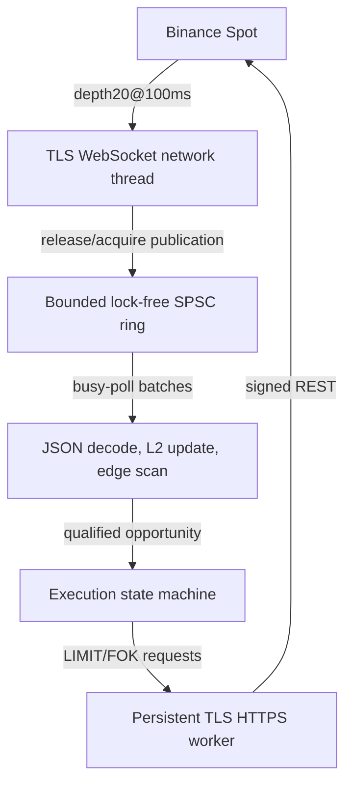

# Binance Spot Triangular Arbitrage Engine

A low-latency, event-driven C++20 trading system that detects and executes triangular arbitrage on Binance Spot — built as a deep dive into exchange connectivity, lock-free concurrency, and microsecond-level latency measurement.

It streams live L2 order books over WebSocket, scans every configured triangle on each update, and (optionally) submits sequential LIMIT/FOK orders through a signed REST gateway. **Verified on-host first-leg submission latency: 283–392 μs across live samples**, measured from the complete inbound market-data TLS record observed in a local capture to the complete outbound order-request TLS record observed on the same host. This excludes exchange processing and order-response time.

## Architecture



A dedicated network thread handles async DNS/TCP/TLS/WebSocket I/O (Boost.Asio + Beast) and copies complete messages into fixed-capacity queue slots. The main thread busy-polls the queue, decodes JSON and decimal prices without floating-point conversion, updates local order books, and scans only the triangles affected by the update. Disk logging runs on a separate async logger to stay off the hot path.

## Measured Results

**Verified live first-leg submission latency** — from complete inbound market-data TLS record to complete outbound order-request TLS record:

The on-host measurements below are cross-checked against 7,172 paired inbound TCP segment/ACK observations used to estimate the difference between local and external capture paths. They do not include exchange processing or order-response time.

| Sample | External capture observed | On-host capture observed | Application processing |
| --- | ---: | ---: | ---: |
| 1 | 880 μs | **392 μs** | 357 μs |
| 2 | 648 μs | **283 μs** | 283 μs |

**Lock-free vs. mutex-based queue**, replayed against identical recorded market data (P99, ms):

| Workload | Mutex-based | Lock-free |
| --- | ---: | ---: |
| 116 triangles, 50x replay speed | 6.13–8.47 | **3.05–6.18** |
| 116 triangles, 500-msg bursts | 40.33–43.03 | **35.74–36.43** |

Lock-free gave no stable edge at recorded (real-time) speed, but cut P99 by 10–17% under burst/accelerated load — at the cost of a dedicated busy-polling core. Full methodology and additional workloads in the [detailed write-up](#deep-dive-documentation) below.

## Technology

**C++20 · Boost.Asio/Beast · OpenSSL · nlohmann/json · CMake** — with Python tooling for replay benchmarking and Linux/TShark packet capture for latency verification.

## Quick Start

```bash
sudo apt install cmake g++ libboost-dev libssl-dev nlohmann-json3-dev python3 tshark

cmake -S . -B build-release -DCMAKE_BUILD_TYPE=Release -DBUILD_TESTING=ON
cmake --build build-release -j2
ctest --test-dir build-release --output-on-failure

./build-release/json_receiver   # reads configs/binance.json
```

Ships in three execution modes — `disabled` (detection only), `paper` (simulated fills, no API calls), and `live` (signed Binance orders) — configured via `configs/binance.json`.

## Packet-Level Latency Analysis

TLS key logging is opt-in (`tls_keylog_file`) and used only for controlled packet-correlation experiments; key logs must never be committed or retained after testing.

```bash
# capture on the trading host
sudo ethtool -K <iface> gro off lro off
sudo tcpdump -i <iface> -nn -s 0 -B 32768 -U \
  -w local.pcap 'tcp and (port 443 or port 9443)'

# correlate application events with local + external captures
python3 tools/analyze_capture_latency.py \
  --local-pcap /path/to/local.pcap \
  --pcap /path/to/external.pcapng \
  --log /path/to/run.jsonl \
  --keys /path/to/capture-session.keys \
  --output /path/to/latency-analysis.json
```

Full setup and limitations: [tools/external_capture.md](tools/external_capture.md).

## Deep-Dive Documentation

This README covers the highlights; the following documents go deeper for anyone evaluating the engineering in detail:

- [execution_plan.md](execution_plan.md) — execution state machine and recovery limitations
- [tools/README.md](tools/README.md) — replay benchmark methodology (uses [tools/replay_benchmark.py](tools/replay_benchmark.py))
- [tools/external_capture.md](tools/external_capture.md) — packet-level latency verification setup
