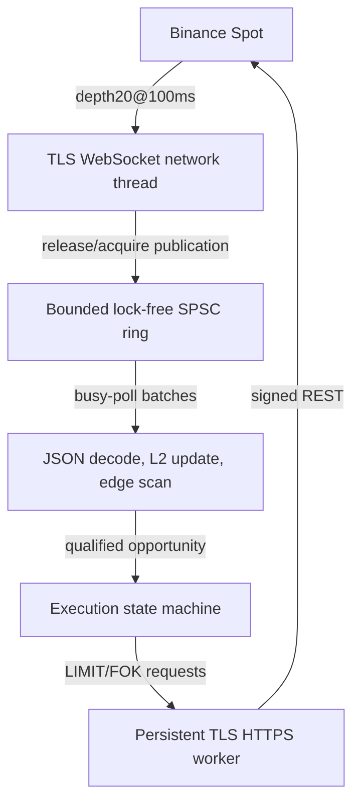

# Binance Spot Triangular Arbitrage Engine

A low-latency, event-driven C++20 trading system that detects and executes triangular arbitrage on Binance Spot — built as a deep dive into exchange connectivity, lock-free concurrency, and microsecond-level latency measurement.

It streams live L2 order books over WebSocket, scans the triangles affected by each update, and submits LIMIT/FOK orders through a signed REST gateway. **Verified on-host market-to-first-order latency: P50 225 μs, P95 392 μs, P99 698 μs across 100 live submissions.** The interval runs from completion of the triggering market-data TLS record in the local capture to completion of the first-leg order-request TLS record. It excludes order-response time.

## Architecture



A dedicated network thread handles async DNS/TCP/TLS/WebSocket I/O (Boost.Asio + Beast) and copies complete messages into fixed-capacity queue slots. The main thread busy-polls the queue, decodes JSON and decimal prices without floating-point conversion, updates local order books, and scans only the triangles affected by the update. Disk logging runs on a separate async logger to stay off the hot path.

## Measured Results

The [100-submission report](latency-analysis1789373319293622.md) contains 100 unique market/order matches and 100 verified TCP/TLS boundary pairs in each capture. Percentiles use the nearest-rank method; all values below are μs.

| Measurement | Samples | Minimum | P50 | P95 | P99 | Maximum |
| --- | ---: | ---: | ---: | ---: | ---: | ---: |
| On-host capture | 100 | 164.000 | **225.000** | **392.000** | **698.000** | 750.000 |
| External capture | 100 | 297.800 | 621.500 | 806.300 | 1163.200 | 1163.800 |
| Application receive → HTTP write completion | 100 | 145.542 | 204.873 | 377.004 | 610.471 | 694.558 |

The application breakdown reports `first_leg_prepare` P50/P95 of 68.328/163.515 μs and `gateway_queue` P50/P95 of 21.690/35.416 μs. Preparation includes scheduling, balance checks, and all-three-leg preflight, even though this run stopped after the first-leg response. The report predates the finer preparation timestamps now available in the analyzer.

The per-order external-minus-local interval has P50 379.900 μs. A separate TCP data/ACK comparison reports 22,832 paired samples with P50 374.900 μs. This is supporting evidence about capture-path differences, not a per-order correction or a one-way network-delay measurement. The local-minus-application residual has P50 13.201 μs; timestamp boundaries and uncertainty prevent attributing it entirely to the network stack. Percentiles of separate components do not add to the percentile of the total.

The test submitted 100 first legs and waited for each gateway response before releasing the executor.

**Lock-free vs. mutex-based queue**, replayed against identical recorded market data (P99, ms):

| Workload | Mutex-based | Lock-free |
| --- | ---: | ---: |
| 116 triangles, 50x replay speed | 6.13–8.47 | **3.05–6.18** |
| 116 triangles, 500-msg bursts | 40.33–43.03 | **35.74–36.43** |

Lock-free gave no stable edge at recorded (real-time) speed, but cut P99 by 10–17% under burst/accelerated load — at the cost of a dedicated busy-polling core. Full methodology and additional workloads in the [detailed write-up](#deep-dive-documentation) below.

## Technology

**C++20 · Boost.Asio/Beast · OpenSSL · nlohmann/json · CMake** — with Python tooling for replay benchmarking and Linux/TShark packet capture for latency verification.

## Quick Start

```bash
sudo apt install cmake g++ libboost-dev libssl-dev nlohmann-json3-dev python3 tshark

cmake -S . -B build-release -DCMAKE_BUILD_TYPE=Release -DBUILD_TESTING=ON
cmake --build build-release -j2
ctest --test-dir build-release --output-on-failure

./build-release/json_receiver   # reads configs/binance.json
```

Ships in three execution modes — `disabled` (detection only), `paper` (simulated fills, no API calls), and `live` (signed Binance orders) — configured via `configs/binance.json`.

## Packet-Level Latency Analysis

TLS key logging is opt-in (`tls_keylog_file`) and used only for controlled packet-correlation experiments

```bash
# capture on the trading host
sudo ethtool -K <iface> gro off lro off
sudo tcpdump -i <iface> -nn -s 0 -B 32768 -U \
  -w local.pcap 'tcp and (port 443 or port 9443)'

# correlate application events with local + external captures
python3 tools/analyze_capture_latency.py \
  --local-pcap /path/to/local.pcap \
  --pcap /path/to/external.pcapng \
  --log /path/to/run.jsonl \
  --keys /path/to/capture-session.keys \
  --output /path/to/latency-analysis.json --progress
```

Full setup and limitations: [tools/external_capture.md](tools/external_capture.md).

## Deep-Dive Documentation

This README summarizes the system; the following documents go deeper for anyone evaluating the engineering in detail:

- [execution_plan.md](execution_plan.md) — execution state machine and recovery limitations
- [tools/README.md](tools/README.md) — capture analysis and replay benchmark methodology (uses [tools/replay_benchmark.py](tools/replay_benchmark.py))
- [tools/external_capture.md](tools/external_capture.md) — packet-level latency verification setup
